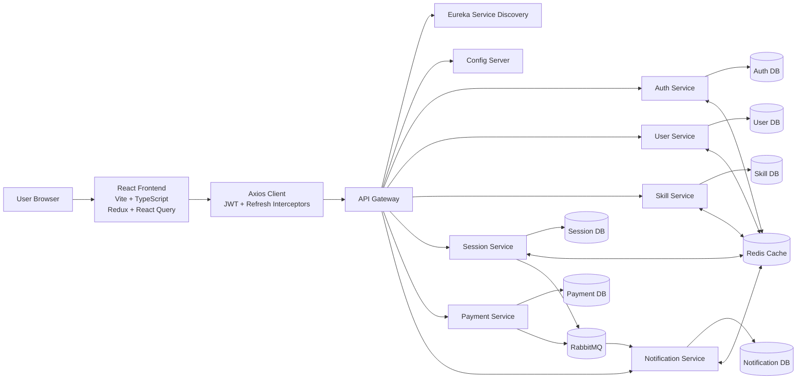
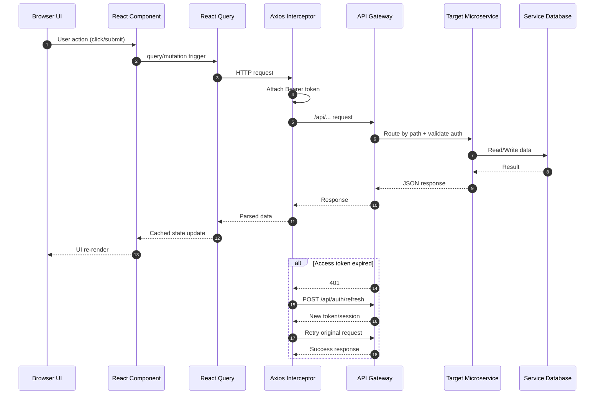
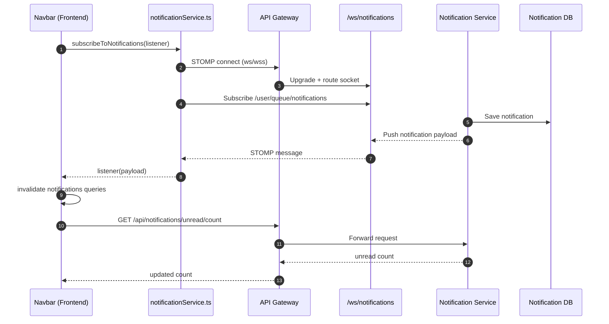

# 12 Frontend and Backend Flow Chart

This file captures the end-to-end flow between the React frontend and SkillSync backend microservices.

## 1) System Flow (Frontend to Backend)



## 2) Request Lifecycle (REST API)



## 3) Real-Time Notification Flow (WebSocket + STOMP)



## 4) Group Messaging Flow (Current Frontend Behavior)

```mermaid
flowchart TD
    A[GroupDetailPage Open] --> B{User joined or admin?}
    B -- No --> C[Show join prompt]
    B -- Yes --> D[Enable message list query]
    D --> E[Poll every 4 seconds]
    E --> F[GET /api/groups/{id}/messages]
    F --> G[Render discussion list]
    G --> E

    H[Post message] --> I[POST /api/groups/{id}/message]
    I --> J[Invalidate discussions query]
    J --> F
```

## Notes

- Notifications are real-time from WebSocket events, then REST data is refreshed.
- Group discussion in frontend currently uses polling (4s), not a WebSocket stream.
- API Gateway is the single entry point for frontend requests.
- Services use database-per-service design and may communicate via events (RabbitMQ).
